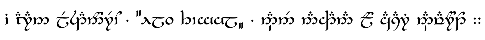

# Tengwar

[crates.io]: https://img.shields.io/crates/v/tengwar?logo=rust&label=crates.io
[docs.rs]: https://docs.rs/tengwar/badge.svg
[![crates.io]](https://crates.io/crates/tengwar)
[![docs.rs]](https://docs.rs/tengwar)

[Tengwar Telcontar]: https://freetengwar.sourceforge.net/tengtelc.html

Automated conversion of Latin text into Tengwar codepoints in the Unicode Private Use Area.
Primarily targets the Classical Quenya mode, with tenuous support for the Sindarin modes of Beleriand and Gondor.

The codepoints used are the ones defined by the [Free Tengwar Font Project](https://freetengwar.sourceforge.net/mapping.html), based on the mapping in the [ConScript Unicode Registry](https://en.wikipedia.org/wiki/Tengwar#ConScript_Unicode_Registry), and will only correctly render if a font is installed that includes them.

## Installation

With [Cargo](https://github.com/rust-lang/cargo) installed, the following command will build and install from [crates.io](https://crates.io) automatically:

    cargo install tengwar

## Usage

When run directly, reads all command-line arguments and prints them back in Tengwar, separated by spaces:

    > tengwar "Elen síla lúmenn' omentielvo :"
        

    > tengwar "Utúlie'n aurë ! Aiya Eldalië ar Atanatári , utúlie'n aurë !."
              

If no arguments are provided, reads from Standard Input and prints transliteration to Standard Output line by line.
All input is assumed to be UTF-8 encoded, and output will also be UTF-8 encoded.

A short summary of the program can be seen by running `tengwar -h`, and much more detailed help text is available with `tengwar --help`.

### Modes

Alternative "Modes" can be selected via command-line switch:

    > tengwar --beleriand "Ennyn Durin aran Moria :. pedo mellon a minno :"
             

    > tengwar --gondor "Ennyn Durin aran Moria :. pedo mellon a minno :"
             

The full list of available modes can be viewed with `tengwar -h`.

### Ligation

Two forms of ligation are currently supported.
The `--ligate-all` option will enable both of them at the same time.

#### Short Carriers

The short carrier () has an alternate "ligating" form (), which extends to the right, connecting to the next character.
When invoked with `--ligate-short` (or `-s`), this program will use the ligating form where appropriate.

Unlike with zero-width joiners (where lack of font support is unlikely to be a problem), this variant is an entirely different character, and may not be provided at all by some fonts.

#### Zero-Width Joiners

In certain typefaces, the [Zero-Width Joiner](https://en.wikipedia.org/wiki/Zero-width_joiner) may be used to form ligatures of Tengwar.
When invoked with the `--ligate-zwj` (or `-z`) switch on the command line, this program will insert joiners into the output text between certain characters, based on various overly convoluted rules.
These rules are based on the ligature behavior of [Tengwar Telcontar], as well as some degree of personal taste.

For typefaces that do not support these ligatures, the presence of the joining characters ***should*** not affect the rendering;
However, it does increase the number of bytes in the output string by approximately 15%.

### Note on punctuation

Tengwar [punctuation](https://at.mansbjorkman.net/teng_punctuation.htm) is essentially impossible to reliably extrapolate from punctuated Latin text.
It is therefore probably best to not even try, and instead to punctuate the input text with the output in mind.

This program does convert punctuation marks into Unicode codepoints, but whitespace is passed through verbatim, neither added nor subtracted¹.
As of this writing at version `0.8.0`, punctuation is processed as can be seen above and in the following table:

| Input              | Output |
|--------------------|:------:|
| `'`, `.`, `,`, `·` |  ``   |
| `:`, `;`           |  ``   |
| `⁝`, `︙`           |  ``   |
| `⁘`, `⁛`, `…`      |  ``   |
| `⸭`                |  ``   |
| `-`                |  ``   |
| `=`                |  ``   |
| `?`                |  ``   |
| `!`                |  ``   |
| `‖`*               |  ``   |
| `(`, `[`, `“`      |  ``   |
| `)`, `]`, `”`, `„` |  ``   |

The Pipe character (`|`) is also converted to ``, but it cannot be included in this table due to a technical limitation of the Markdown format.

It may be important to note that the Tilde (`~`) is **not** converted, despite strongly resembling the punctuation character ``.
This is because the Tilde represents a specific type of whitespace in LaTeX, and running within LaTeX is the motivating use case for the creation of this program.
The Tilde is left alone so that it can safely pass through and be read by LaTeX.

---

¹ While ***this program*** does not affect whitespace, it can only work with the discrete arguments provided to it by the environment running it.
Most environments will split your input at spaces and provide the surrounding words as unconnected values;
This program cannot distinguish between `tengwar asdf qwert` and `tengwar asdf<TAB>qwert`.
It is therefore highly recommended to enclose all of your input text in double quotes.

---

## Features

[Cargo Features](https://doc.rust-lang.org/cargo/reference/features.html#command-line-feature-options) allow very powerful changes to the behavior of a program to be baked in at compile-time.

### `dots-standard`

Several codepoints defined in the CSUR Tengwar block are punctuation marks composed of dots.
Since Unicode already defines many dot punctuation characters, it may be preferable to use those wherever possible.
Compiling this program with `--features "dots-standard"` will cause it to use standard Unicode characters with the same arrangements, instead of the ones in the Tengwar block.

---

## Usage in LaTeX

The following is a minimum working example using [XeLaTeX](https://xetex.sourceforge.net/).
It uses the [Tengwar Telcontar] font with the Graphite renderer, and the given command will produce `main.pdf` as its output.

```latex
% main.tex
\documentclass[12pt]{article}
\usepackage{fontspec}

\defaultfontfeatures{Renderer=Graphite}
\newfontfamily\TengTelc[WordSpace=2]{Tengwar Telcontar}

\newcommand{\Tengwar}[2][]{\input{|tengwar #1 -- '#2'}\unskip}
\newcommand{\Classical}[2][\TengTelc]{{#1\Tengwar[-Qrsz]{#2}}}
\newcommand{\Beleriand}[2][\TengTelc]{{#1\Tengwar[-Brsz]{#2}}}
\newcommand{\Gondor}[2][\TengTelc]{{#1\Tengwar[-Grsz]{#2}}}

\begin{document}
    % "The king of Doriath, Elu Thingol, was slain by Dwarves from Nogrod."
    \Classical{i aran Lestanórëo ,}
    \Beleriand{“Elu Thingol„}
    \Classical{, nánë nahtana ló Casari Návaróto ::}
\end{document}
```

```bash
xelatex -interaction=nonstopmode --shell-escape main.tex
```


